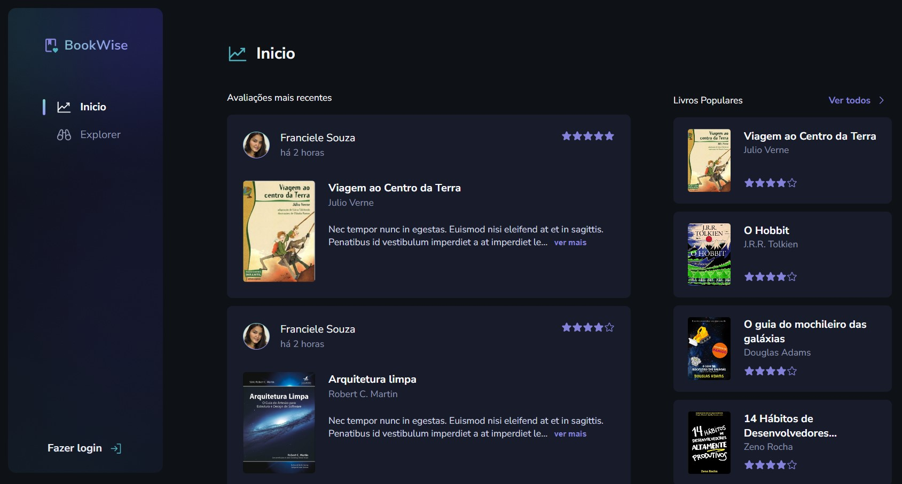

<h1 align="center">
  
  Book Wise
</h1>

  

<h4 align="center"> 
	🚀 Aplicação finalizada 🚀
</h4>

## 💻 About

O projeto **Book Wise** é uma plataforma de recomendações de livros para leitores, um lugar onde eles possam avaliar e ver avaliações de outros leitores sobre os mais diversos livros.

Vale ressaltar que este projeto foi desenvolvido como conclusão de um desafio proposto no curso/trilha **Ignite React** oferecido pela [Rocketseat](https://www.rocketseat.com.br/).

---

## 🔗 Deploy

O deploy da aplicação pode ser acessada através da seguinte URL base: https://book-wise-kappa.vercel.app/

---

## 🎨 Layout

Você pode visualizar o layout do projeto através [desse link](https://www.figma.com/file/jTau6bMNSF10GkqwYAbuLA/BookWise/duplicate). É necessário ter conta no [Figma](https://www.figma.com/) para acessá-lo.

## 🛠 Technologies

As seguintes principais ferramentas foram usadas na construção do projeto:

- **[TypeScript](https://www.typescriptlang.org/)**
- **[Next.js](https://nextjs.org/)**
- **[Stitches](https://stitches.dev/)**
- **[RadixUI](https://www.radix-ui.com/)**
- **[Prisma](https://www.prisma.io/)**
- **[Zod](https://zod.dev/)**
- **[Phosphor-Icons](https://phosphoricons.com/)**
- **[@tanstack/react-query](https://tanstack.com/query/latest)**
- **[Axios](https://axios-http.com/ptbr/docs/intro)**
- **[Next-Auth](https://next-auth.js.org/)**
- **[Next-SEO](https://github.com/garmeeh/next-seo)**

> Para mais detalhes das dependências gerais da aplicação veja o arquivo [package.json](./package.json)
